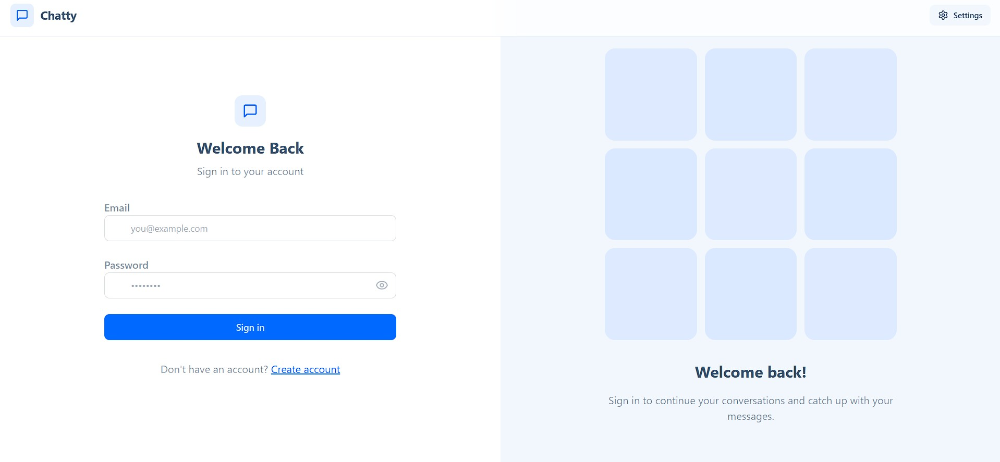
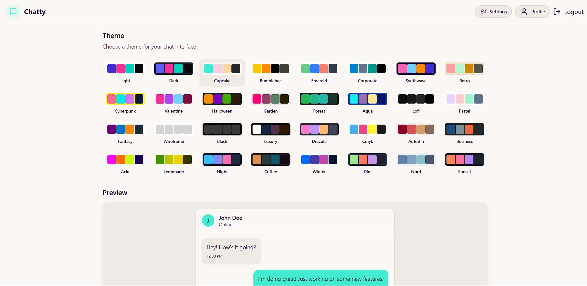

# 📬 Real-Time Messaging App

#### A full-stack real-time messaging platform enabling one-on-one chat with text and images. Built from the ground up with modern technologies, this app delivers real-time updates, secure authentication, and a fully responsive, themeable interface.

## 🌐 Live Demo

🔗 [View Deployed App](https://whisper-73xo.onrender.com)

## Milestone 2: Distributed Backend

The `feat/distributed-backend` branch adds Redis-backed Socket.IO broadcasting,
shared multi-device presence with expiring leases, distributed rate limiting,
and a Docker Compose stack with two Node.js backends behind NGINX. This is a
local, verified development topology; the live demo above has not been updated.

Read the [detailed architecture and interview guide](docs/MILESTONE_2_DISTRIBUTED_BACKEND.md)
for request flows, data structures, failure behavior, tests, tradeoffs, setup,
and honest résumé/interview examples.

Start the local stack from the repository root with Docker Desktop running:

```sh
docker compose up --build -d --wait
```

Open `http://localhost:8080`. The stack uses its own MongoDB volume and does not
inherit `backend/.env`. Cloudinary credentials are optional for text chat; set
them explicitly if you want image uploads. Do not use the example JWT secret or
unauthenticated local data services in production.

Run verification:

```sh
npm test --prefix backend
docker compose build integration-tests
docker compose run --rm --no-deps integration-tests
```

The integration runner creates disposable accounts, exchanges messages between
different nodes, tests receipts/presence/rate limits, injects failures into its
own backend processes, and cleans up its own records. Run it only against the
local development stack. Stop local containers without removing chat history:

```sh
docker compose stop
```

---

### 🔐 Login Page



### 💬 Chat Interface


### 🎨 Theme Picker



## ✨ Features

- 🔐 **JWT Authentication** — Secure login & signup with cookie-based sessions
- 💬 **Live Messaging** — Real-time communication using WebSockets (Socket.IO)
- 🖼️ **Image Upload** — Share images via Cloudinary integration
- 🟢 **Live Presence** — Online/offline indicators
- 🧭 **Protected Routes** — Accessible only after authentication
- 🎨 **Theme Customization** — 30+ DaisyUI themes
- 📱 **Mobile-Responsive** — Clean UI for desktop and mobile
- ⚡ **Optimized UX** — Loading skeletons, toasts, scroll-to-latest, and smooth transitions

---

## 🛠 Tech Stack

### Frontend

- React 19 + Vite
- Zustand (state management)
- Tailwind CSS 3 + DaisyUI 5
- React Router DOM
- React Hot Toast
- Lucide React (icon set)

### Backend

- Node.js + Express
- MongoDB + Mongoose
- Socket.IO (real-time communication)
- JWT (authentication)
- Cloudinary (media handling)

---

## 🎨 UI Overview

- Figma-based layout and visual planning
- Custom theme switcher (30+ themes)
- Chat view with auto-scroll to latest message
- Responsive sidebar and contact list
- Toast notifications and modal dialogs for feedback

---

## 📂 Folder Structure

```bash
.
├── frontend/
│   ├── components/
│   ├── pages/
│   ├── store/
│   └── utils/
└── backend/
    ├── controllers/
    ├── routes/
    ├── models/
    ├── middleware/
    └── lib/

```

## 🧠 What I Built & Learned

- ✅ Developed and deployed a full-stack messaging system
- 🧱 Structured a scalable React + Zustand architecture for managing auth and chat state
- 💬 Implemented live communication features using Socket.IO
- 🔐 Handled secure login and session persistence using JWT and cookies
- 🎨 Designed and implemented a responsive and themeable UI using TailwindCSS and DaisyUI
- 🖼️ Integrated Cloudinary for image handling and media delivery
- ⚙️ Gained experience managing asynchronous workflows, real-time state, and deployment

---

## 🌱 Future Enhancements

- ✨ Add light/dark mode auto-detection using user preferences
- 📁 Introduce user settings for notification preferences
- 🔄 Add persistent login across sessions using refresh tokens
- 🔍 Improve contact search and filtering for enhanced UX

## License

This project is licensed under the MIT License.  
© 2025 [Haider Ali]
