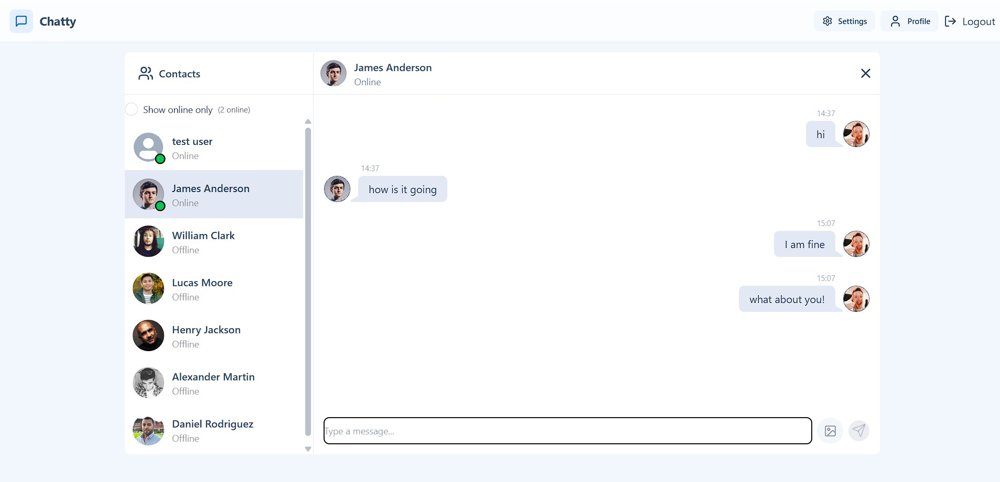

# Whisper

A full-stack messaging application focused on reliable delivery and cross-server real-time communication. Built with React, Express, Socket.IO, MongoDB and Redis, with two backend instances behind NGINX in the local Docker stack.

[](https://github.com/haiderali077/whisper/actions/workflows/ci-cd.yml)

[Hosted demo](https://whisper-73xo.onrender.com) · [Quick start](#quick-start) · [Architecture](#architecture) · [Tests](#tests) · [Local performance results](#local-performance-results)

The hosted demo is an earlier deployment; it should not be treated as evidence of the two-node topology. The distributed setup and commands below are reproducible locally.

## Engineering highlights

- **Retry-safe message creation:** client-generated IDs and a MongoDB unique index prevent a retried send from creating another record, including when a retry reaches a different backend.
- **Persistent offline outbox:** IndexedDB retains unsent messages across refreshes. The client exposes pending, queued, failed and sent states, retries with exponential backoff, and synchronizes after reconnection.
- **Cross-instance messaging:** the Socket.IO Redis adapter broadcasts to user rooms across backend processes, including delivered/read receipt updates and multiple connected devices.
- **Shared presence and quotas:** Redis-backed connection leases preserve multi-device presence and expire stale entries after a crash. Atomic Lua scripts enforce rate limits shared across nodes.
- **Evidence and automation:** real distributed integration tests, a bounded load harness, and GitHub Actions checks gate delivery of a versioned application image.



## Architecture

```text
React client
    |
    | HTTP API + Socket.IO
    v
NGINX
    |-- backend-1 --|
    |              |-- MongoDB: users, messages, receipt timestamps
    |-- backend-2 --|
                   |-- Redis: live broadcasts, presence leases, shared quotas
```

HTTP requests use round-robin routing. Socket.IO connections use JWT-cookie affinity so polling requests remain on the same backend; NGINX also proxies WebSocket upgrades.

Messages are persisted in MongoDB before live notification. Each authenticated socket joins a `user:<id>` room. The Redis adapter forwards room broadcasts to other instances, allowing the API request and recipient's socket to reside on different nodes. Delivered/read timestamps are persisted and status updates reach both users' rooms.

Redis is not the message database or a durable event queue. Reconnection synchronization retrieves persisted history; Pub/Sub alone does not guarantee delivery during an outage. `/health` checks liveness, while `/ready` requires MongoDB connectivity and the application's Redis clients to be ready. Dependency outages reject affected operations rather than silently running a partially distributed service.

Key implementation files: [message controller](backend/src/controllers/message.controller.js), [Socket.IO setup](backend/src/lib/socket.js), [presence leases](backend/src/lib/presence.js), [rate limiting](backend/src/lib/rateLimit.js), and [NGINX routing](deploy/nginx.conf).

## Product features

- One-to-one text chat and Cloudinary-backed image sharing.
- JWT cookie authentication for API requests and sockets.
- Delivered/read receipts, retry states and offline message recovery.
- Cursor-based history pagination and reconnect synchronization.
- Online indicators across multiple devices and backend instances.
- Responsive interface, profile images and theme selection.

## Tech stack

| Layer | Technologies |
| --- | --- |
| Client | React 19, Vite, Zustand, React Router, Tailwind CSS, DaisyUI |
| API and real-time transport | Node.js 24 in Docker/CI, Express 5, Socket.IO |
| Persistence and shared state | MongoDB, Mongoose, Redis, Socket.IO Redis adapter |
| Authentication and media | JWT cookies, bcrypt, Cloudinary |
| Deployment tooling and verification | Docker, Docker Compose, NGINX, Node test runner, ESLint, GitHub Actions, GHCR |

## Quick start

Requirements: Git and Docker Desktop, or Docker Engine with a modern Docker Compose v2 installation. Node.js 24 is needed for host-side development and unit-test commands.

```sh
git clone https://github.com/haiderali077/whisper.git
cd whisper
docker compose -p whisper up --build -d --wait
```

Open [localhost:8080](http://localhost:8080). Create two accounts in separate browser profiles, then exchange messages. Distinct profiles keep authentication cookies separate; socket placement should be verified rather than assumed from having two containers.

The stack starts MongoDB, Redis, two backends and NGINX. It uses its own MongoDB volume and explicit development configuration, not `backend/.env`. No external database account is required for this local setup.

| Local endpoint | Purpose |
| --- | --- |
| `http://localhost:8080` | Application through NGINX |
| `http://localhost:5001` / `http://localhost:5002` | Direct backend diagnostics |
| `http://localhost:8080/health` | Liveness and instance identity |
| `http://localhost:8080/ready` | Dependency readiness |

Stop the normal stack without deleting chat history:

```sh
docker compose -p whisper stop
```

### Configuration

Text chat works without Cloudinary. To test image uploads, export `CLOUDINARY_CLOUD_NAME`, `CLOUDINARY_API_KEY` and `CLOUDINARY_API_SECRET` before starting Compose. Do not commit those credentials.

For a backend run outside Compose, the configuration requires `MONGODB_URI`, `REDIS_URL` and `JWT_SECRET`. CORS origins, trusted proxy count, instance ID, Redis namespace, presence timing and rate budgets are configured in [config.js](backend/src/lib/config.js). Runtime secrets and TLS must be configured separately for a real deployment.

The local example JWT secret and unauthenticated development databases are not production settings.

### Frontend development

With the Compose backend running, start Vite against NGINX:

```sh
npm ci --prefix frontend
VITE_BACKEND_URL=http://localhost:8080 npm run dev --prefix frontend
```

Open Vite's local URL, normally `http://localhost:5173`. `VITE_BACKEND_URL` selects the API/socket origin; the Docker-built frontend uses same-origin requests through NGINX.

## Tests

### Unit, lint and build checks

```sh
npm ci --prefix backend
npm ci --prefix frontend
npm test --prefix backend
npm run lint --prefix frontend
npm run build --prefix frontend
```

The unit suite has 15 tests: eight for backend configuration, presence and rate-limit behavior, plus seven for the load harness's safety guards, statistics, lifecycle accounting, deadlines and budgets.

### Distributed integration tests

Use a disposable project rather than the normal chat stack:

```sh
docker compose -p whisper-ci -f compose.yaml -f compose.ci.yaml --profile test build
docker compose -p whisper-ci -f compose.yaml -f compose.ci.yaml up -d --wait --wait-timeout 180 mongo redis backend1 backend2 load-balancer
docker compose -p whisper-ci -f compose.yaml -f compose.ci.yaml --profile test run --rm --no-deps integration-tests
```

The suite includes 19 specific checks inside one parent test, reported as 20 tests by Node. It verifies cross-node messages and receipts, duplicate prevention, receipt authorization, multiple-device presence, NGINX routing and upgrades, crash lease expiry, graceful shutdown, Redis network-loss recovery, and shared message/receipt/login quotas.

Afterward, remove only the disposable test project:

```sh
docker compose -p whisper-ci -f compose.yaml -f compose.ci.yaml down --volumes --remove-orphans
```

That command deletes the **test project's** MongoDB volume. Keep the exact project name; do not use volume deletion to stop the normal chat stack.

Test sources: [backend unit tests](backend/test/unit.test.js), [harness unit tests](backend/test/load.test.js), and [distributed integration tests](backend/test/distributed.integration.test.js). There are currently no automated browser interaction tests.

## Local performance results

Two local runs on September 15, 2026 used 50 authenticated sockets in 25 verified cross-instance pairs. Each run had a five-second warmup, then 30 seconds each at 10, 50 and 100 messages/second.

| Offered rate | Measured messages across both runs | Synthetic read-receipt p95, run 1 / run 2 |
| --- | --- | --- |
| 10 messages/s | 600 | 23.609 / 22.756 ms |
| 50 messages/s | 3,000 | 14.144 / 14.276 ms |
| 100 messages/s | 6,000 | 17.166 / 11.539 ms |

All 9,600 measured messages completed the full observed lifecycle, with zero reported failures, drops, duplicate deliveries or socket disconnects. Persistence and owned-fixture cleanup checks passed. Warmup adds another 100 messages across both runs and is excluded from the table.

Conditions: Docker Desktop 28.5.1, an ARM64 Linux VM with 10 visible logical CPUs and about 7.65 GiB RAM, Node 24.21.0, Redis 7.4.11, MongoDB 8.0.32 and NGINX 1.28.3. Services shared the VM without dedicated resource limits. The harness used short text, WebSocket-only connections, immediate synthetic receipts and elevated finite test quotas.

Latency samples include fully completed messages only; read percentiles alongside errors and generator lag. These short runs do **not** establish maximum capacity, production-user counts, human read latency, failover under load or a speedup over one server. The highest tested rate was 100 messages/second, not a demonstrated saturation limit.

### Reproduce the workload

The benchmark uses separate MongoDB/Redis services and no host-published ports:

```sh
docker compose -p whisper-load -f compose.load.yaml --profile load build
docker compose -p whisper-load -f compose.load.yaml up -d --wait mongo redis backend1 backend2 load-balancer
install -d -m 0777 docs/performance/results
docker compose -p whisper-load -f compose.load.yaml --profile load run --rm load-tests
docker compose -p whisper-load -f compose.load.yaml stop
```

The report directory is pre-created with writable permissions for the non-root container; these permissions apply only to local benchmark output, not credentials or application data. Defaults reproduce the workload shape above; timings vary by environment. Each message requires HTTP creation, receiver delivery, two receipt acknowledgements and two sender-visible status updates. Reports include latency percentiles, completion throughput, errors, generator health, persistence and cleanup.

The implementation is in [run.js](backend/load/run.js), [lib.js](backend/load/lib.js) and [compose.load.yaml](compose.load.yaml). Detailed notes and raw JSON/Markdown results remain local under Git-ignored `docs/`; no public raw-report link is implied.

## CI and container delivery

[The GitHub Actions workflow](.github/workflows/ci-cd.yml) runs lint, backend syntax/unit checks, the frontend build, distributed integration tests and a four-socket messaging smoke. It runs on pull requests to `main`, pushes to `main`/`feat/**`/`fix/**`, and manual dispatch.

Only a successful push to `main` publishes an application image to `ghcr.io/haiderali077/whisper:sha-<full-commit-sha>`. Test jobs use read-only repository permissions and disposable data; package write permission is scoped to delivery. [The initial main run](https://github.com/haiderali077/whisper/actions/runs/35043943551) passed both test jobs and image publication.

This is **continuous delivery of an image, not automatic production deployment**. It does not configure Render or production databases. Required checks must also be enabled in GitHub branch rules to enforce merge restrictions. The delivery job rebuilds from the tested source revision; it does not promote the exact integration-tested image digest.

## Repository map

```text
backend/
  src/controllers/    Authentication and message API behavior
  src/lib/            Redis, sockets, presence, quotas and configuration
  src/models/         MongoDB user/message schemas and indexes
  test/               Backend, harness and distributed regression tests
  load/               Bounded messaging load generator
frontend/
  src/components/     Chat interface and reusable UI
  src/pages/          Authentication, chat, profile and settings screens
  src/store/          Client authentication/chat/theme state
  src/lib/            API origin, IndexedDB outbox and helpers
deploy/               NGINX configuration and image
.github/workflows/    Automated verification and image delivery
Dockerfile            Multistage frontend/backend/test images
compose.yaml          Local distributed chat stack
compose.ci.yaml       Disposable integration-test overlay
compose.load.yaml     Isolated benchmark stack
```

## Current scope and limitations

The project demonstrates retry-safe persistence, cross-process communication, shared ephemeral state and reproducible verification. It is not a production high-availability platform: MongoDB and Redis are single services in the local topology, and centralized validation, stricter upload-type checks, broader security coverage and automated browser tests remain future work.

For questions or reproducible bugs, [open an issue](https://github.com/haiderali077/whisper/issues). Maintained by [haiderali077](https://github.com/haiderali077).
